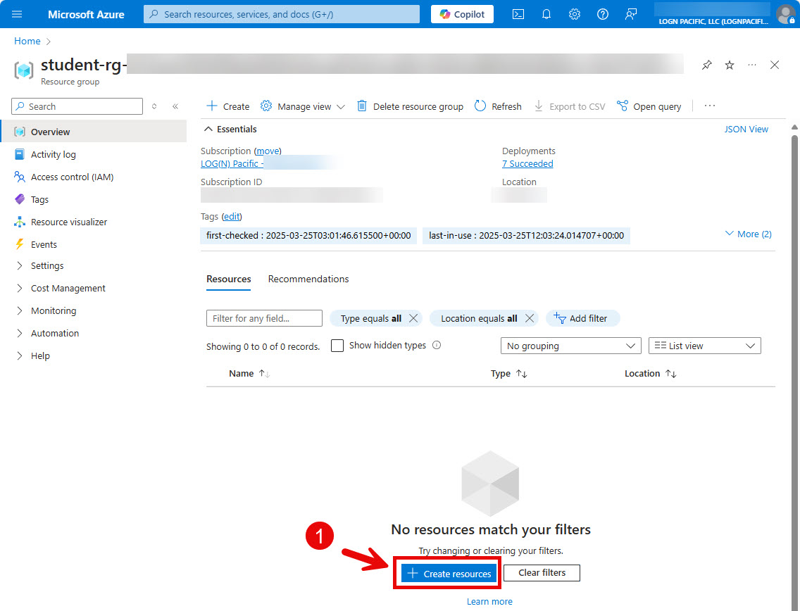
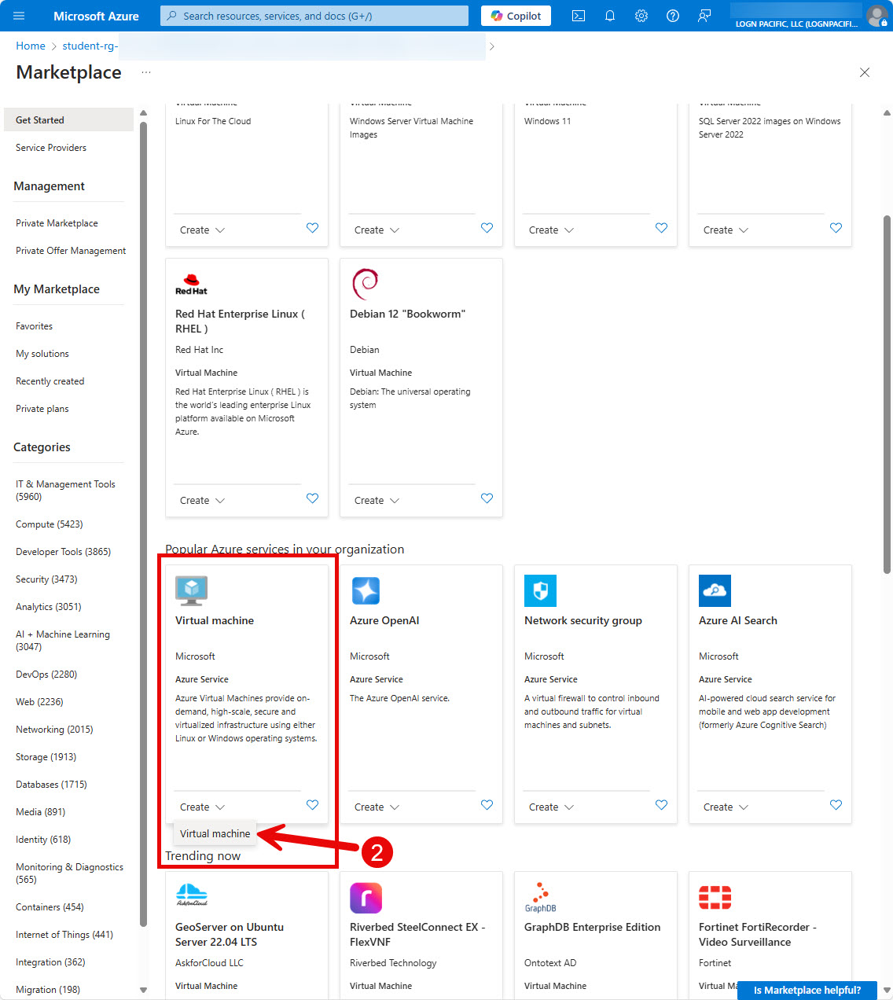
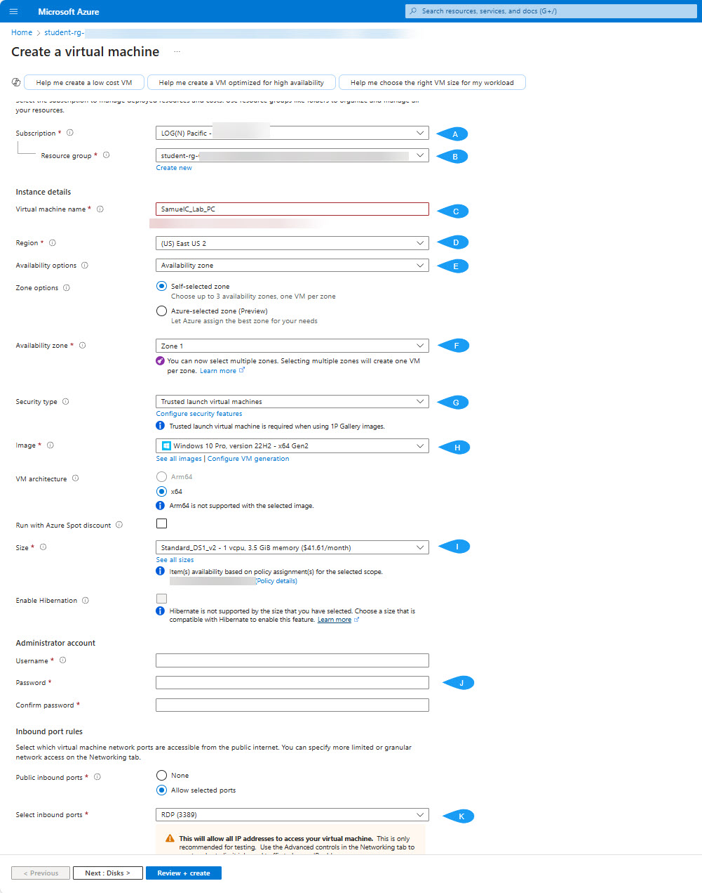
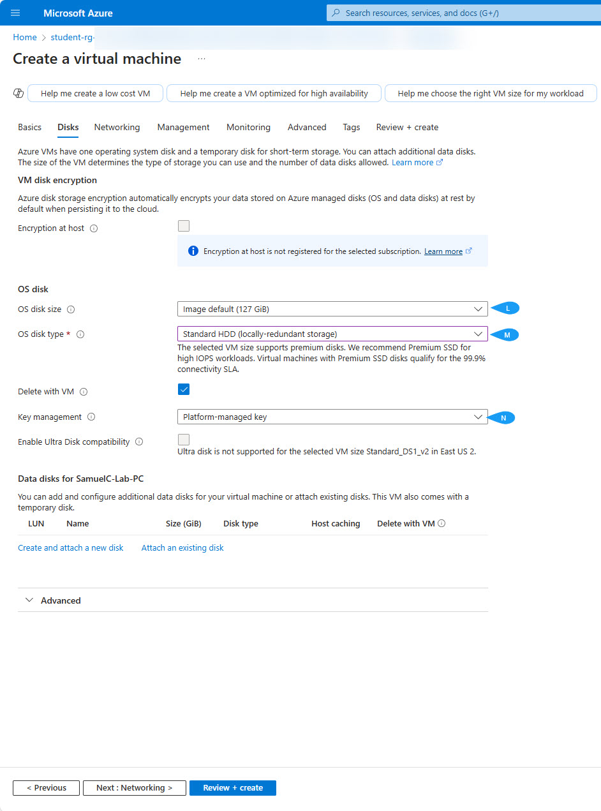
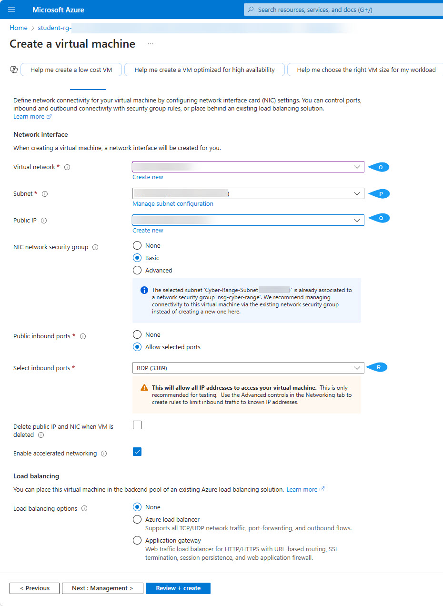
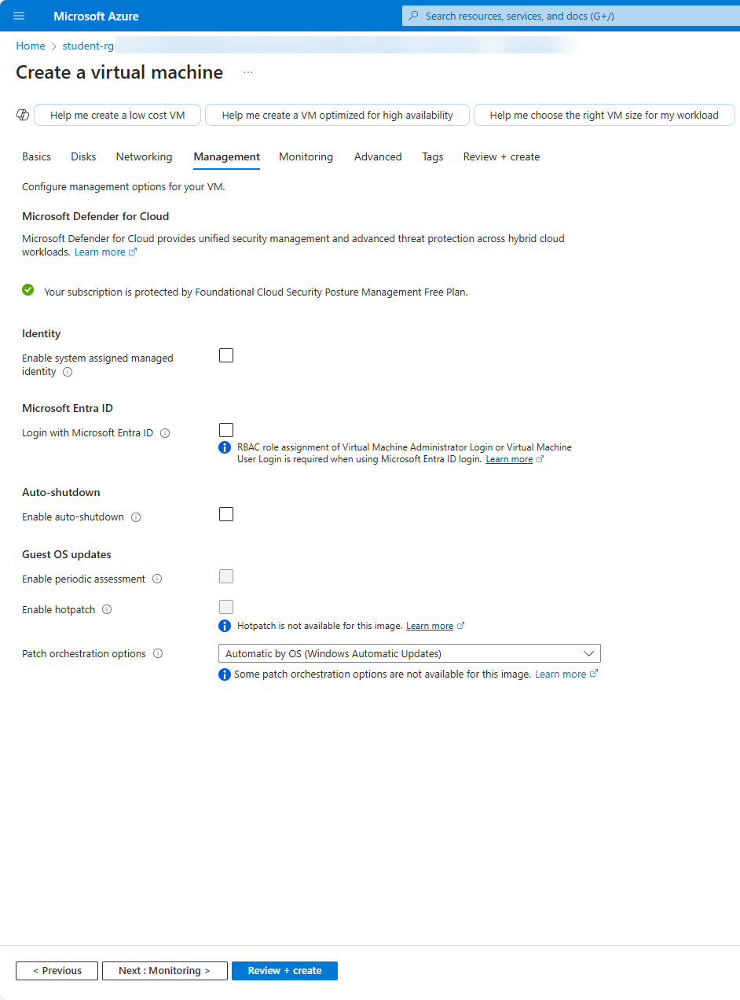
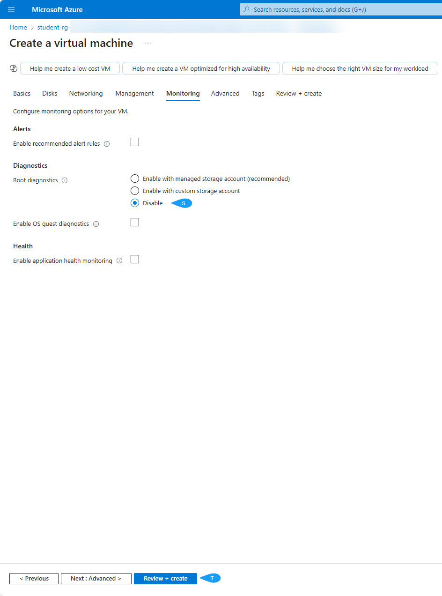
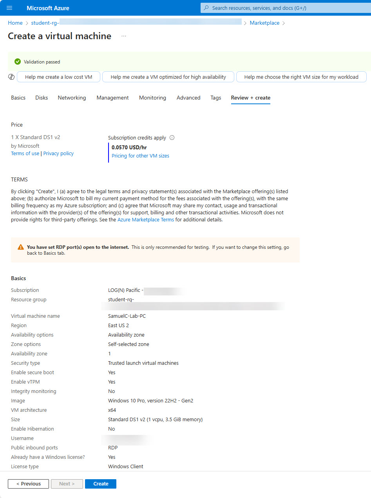
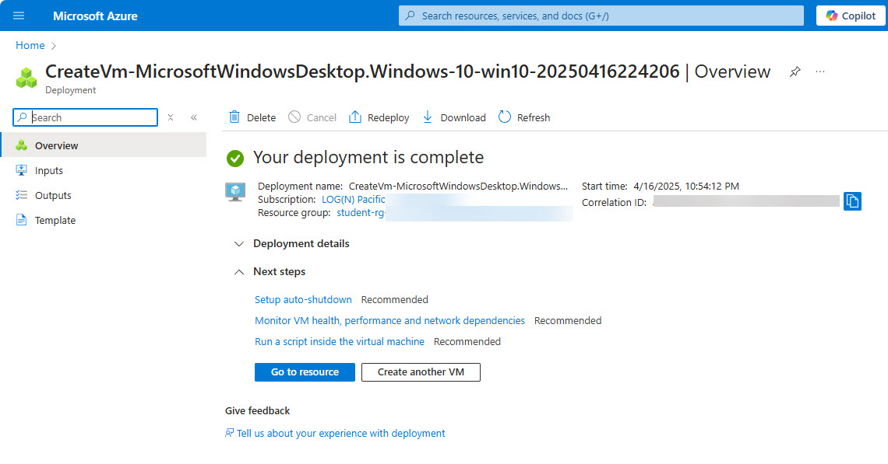
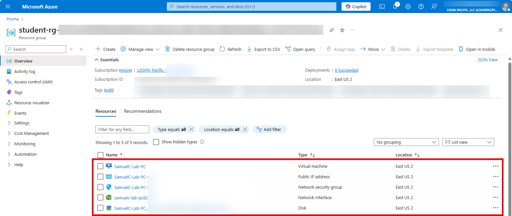

  

<h1 align="center">Azure Virtual Machine Deployment</h1>

# 🚀 Azure Virtual Machine Deployment

  
  
  
  
  

# Project Objective
This project focuses on building a secure and functional Azure Virtual Machine (VM) environment from the ground up. The goal was to configure key settings, strengthen encryption, and tighten network security — all essential for enabling secure remote access and supporting cybersecurity operations like vulnerability management and threat hunting.

# Tools 
- Azure Portal – VM deployment and management
- Azure Key Vault – Encryption key storage
- Azure Network Security Groups – Traffic filtering and access control
- Remote Desktop Protocol (RDP) – Remote connection setup

# Skills Gained

- Deploying and configuring Azure Virtual Machines
- Implementing data encryption with platform-managed keys
- Setting up network security groups and firewall rules
- Establishing secure remote access using RDP
- Building cloud environments for cybersecurity practice

## Environment Setup
Deployed using Microsoft Azure's cloud infrastructure.  
Built an isolated resource group with a virtual network and securely configured subnets to simulate a real-world, secure enterprise environment.

# Walkthrough

1. [Adding a Resource to Azure Group](#step-1-adding-a-resource-to-azure-group)
2. [Programming Languages](#step-2-azure-marketplace)
3. [Basics Tab](#step-3-basics-tab)
4. [Disk Tab](#step-4-disk-tab)
5. [Network tab](#step-5-network-tab)
6. [Management tab](#step-6-management-tab)
7. [Monitoring tab](#step-7-monitoring-tab)
8. [Azure Virtual Machine Review Page](#step-8-azure-virtual-machine-review-page)
9. [Azure Virtual Machine Deployment Confirmation Page](#step-9-azure-virtual-machine-deployment-confirmation-page)
10. [Azure Resource Group Homepage](#step-10-azure-resource-group-homepage) 
##

### Step 1 Adding a Resource to Azure Group

> _Once in your resource group, you can click on the 'Create Resource' button to open the resource marketplace._
> 

> 
### Step 2: Azure Marketplace

> _Access the Azure Marketplace to select and configure your VM image._

> 
### Step 3: Basics Tab

> _In the Basics tab, configure essential settings for your Azure Virtual Machine, such as the subscription, resource group, and VM name._
- **[A]** Select the appropriate subscription. I had to select the one that had my resource group in it.
- **[B]** Select the appropriate resource group. I was given this resource group.
- **[C]** Create the name of your virtual machine.
- **[D]** Select the region according to my time zone.
- **[E]** Keep this as is.
- **[F]** Keep this as is.
- **[G]** Trusted launch virtual machine: This offers secure boot, vTPM, and boot integrity to ensure a secure boot-up.
- **[H]** Select the OS you want.
- **[I]** Select standard-ds1-v2 vCPU, 3.5 GiB memory ($41.61/month). - Cheaper option.
- **[J]** Create a username and password. Make sure that it is at least 15 characters or longer with special characters, lowercase, and uppercase to ensure it is secure.
- **[K]** If you want to be able to remote into via RDP, then turn this on. I will, as I will use this virtual machine to conduct vulnerability management and threat hunting and other cybersecurity projects.
- _Go to the next tab: Disks_

> 
### Step 4: Disk Tab

> _In the Disk tab, configure the storage options for your Azure Virtual Machine._

- **[L]** Select the desired OS disk size.

- **[M]** Select the desired disk type.

- **[N]** Enabling platform-managed keys for the OS disk ensures automatic encryption (at rest)

- _Go to the next tab: Network_

> 
### Step 5: Network tab

> _In the Networking tab, configure the network settings for your Azure Virtual Machine._

- **[O]** Select the appropriate virtual network. 

- **[P]** Select the appropriate subnet.

- **[Q]** Select this option only if you are okay with having a public IP address. This will increase the chance of exposure and also be a target for malicious attacks from the network.

- **[R]**

- _Go to the next tab: Management_
  

> 
### Step 6: Management tab

> _In the Management tab, configure the management settings for your Azure Virtual Machine._

- No need to modify anything on this page.

- _Go to the next tab: Monitoring_
  

> 
### Step 7: Monitoring tab

> _In the Monitoring tab, configure the monitoring settings for your Azure Virtual Machine._

- **[S]** Disable boot diagnostics as it will increase boot-up time.
  
- **[T]** Review and create the VM.

- _Go to the next page: Review + Create_

> 
### Step 8: Azure Virtual Machine Review Page

> _Review all the settings and create the VM._

-  Review and create the VM.

- _Go to the next page: Create_

> 
### Step 9: Azure Virtual Machine Deployment Confirmation Page

> _Confirm the deployment of your Azure Virtual Machine._

- _Go to the next page: Go To Resource_

> 
### Step 10: Azure Resource Group Homepage

> _Return to the Azure Resource Group homepage.._
>

## Outcomes and Lessons Learned
- Gained hands-on experience deploying and configuring Azure Virtual Machines from the ground up.
- Strengthened skills in applying encryption using platform-managed keys to secure data at rest.
- Learned to configure Network Security Groups (NSGs) and firewall rules to tightly control traffic flow.
- Built a secure cloud environment capable of supporting cybersecurity tasks like vulnerability management and threat hunting.
- Understood the importance of balancing remote access setup (RDP) with strict security controls to minimize exposure risks.
- Gained practical insight into how cloud infrastructure must be methodically planned, secured, and monitored for enterprise use.
